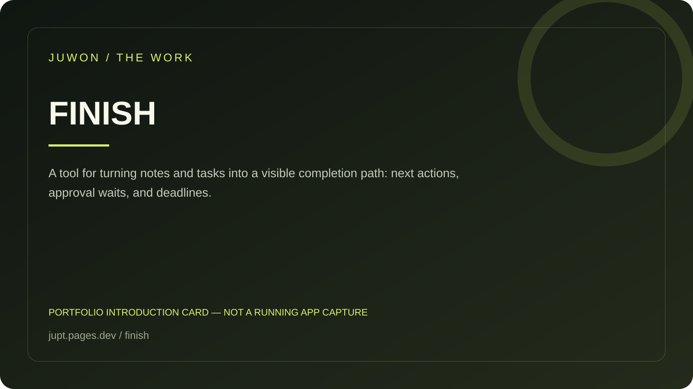

<!-- JUWON-PORTFOLIO-INTRO:START -->
# FINISH



*Portfolio introduction card, not a screenshot of a running application.*

*포트폴리오 소개 카드입니다. 실행 화면 캡처가 아닙니다.*

## English

A tool for turning notes and tasks into a visible completion path: next actions, approval waits, and deadlines.

[View JUWON's portfolio](https://jupt.pages.dev/) · [Browse the project collection](https://jupt.pages.dev/projects)

**Scope:** This README presents the repository's documented intent and recorded visual evidence. It does not certify that every feature is complete, deployed, or currently working. Follow the original setup, safety, and license documentation below.

## 한국어

메모와 할 일에서 다음 행동·승인 대기·마감일을 뽑아 완료 경로를 보여주는 도구.

[JUWON 포트폴리오 보기](https://jupt.pages.dev/) · [전체 프로젝트 보기](https://jupt.pages.dev/projects)

**확인 범위:** 저장소의 문서상 목적과 기록된 화면 근거를 소개합니다. 모든 기능의 완성·배포·현재 정상 작동을 보증하지 않습니다. 설치법·안전 주의사항·라이선스는 아래 기존 문서를 확인하세요.
<!-- JUWON-PORTFOLIO-INTRO:END -->

---

## Original documentation / 기존 문서

# FINISH 🧭

> **You do not need another task list. You need fewer unfinished things.**

FINISH turns the messy text already sitting in your inbox, notes, or Markdown files into a small, reviewable path toward completion:

**What is the next move? What is waiting on your approval? What has a deadline?**

No account. No model. No cloud dependency. No silent actions. Just a local report you can inspect before you do anything consequential. 🔒

## The one-minute demo 🚀

```bash
npm install
npm run build
node dist/cli.js demo --output ./out/demo.html
```

Open `out/demo.html` in any browser. The demo turns a bill and a return request into a readable plan, and clearly marks payment as **Approval required**.

Try a real sentence:

```bash
node dist/cli.js analyze --text "Electric bill: pay $83.20 by 2026-08-28"
```

```text
Next action: Verify the amount and recipient before paying.
{
  "schemaVersion": "0.1",
  "title": "Electric bill",
  "summary": { "total": 1, "approvalRequired": 1, "deadlines": 1 }
}
```

## Why FINISH exists ✨

Task lists collect intentions. They rarely answer the question that blocks the day:

> “What exactly should I do next, and what must I check before I do it?”

FINISH preserves the evidence from the original note, extracts explicit actions and dates, and turns them into a plan with a visible safety boundary. It is useful for bills, returns, forms, appointments, replies, and the small admin tasks that stay open because the next move is unclear.

## What works today ✅

- Deterministic action extraction from English and Korean phrases.
- Explicit ISO dates such as `2026-08-28` and readable month/day dates.
- Stable JSON plans for scripts, review, and future integrations.
- Human-readable Markdown for terminals, issues, and pull requests.
- Self-contained HTML with inline CSS and no external requests.
- Workspace guards against `..` traversal, outside absolute paths, and symlink escapes.
- Approval boundaries for payment, booking, replies, and submissions.

## Safety is a feature 🛡️

FINISH v0.1 does **not** pay, book, send, submit, install, call a shell, or contact a network. It prepares a next step and stops at the boundary where a human should review the details.

| Item | FINISH can do | FINISH will not claim to do |
| --- | --- | --- |
| Pay a bill | Identify the payment and its deadline | Pay it or say it was paid |
| Return an item | Remind you to check the window and receipt | Create a label or start a return |
| Reply to a message | Ask you to review a draft | Send the message |
| Submit a form | Ask you to check fields and attachments | Submit it |

## CLI 📦

Analyze direct text:

```bash
node dist/cli.js analyze --text "Return the headphones by 2026-08-30"
```

Analyze a local file and write JSON:

```bash
node dist/cli.js analyze \
  --input ./examples/bill-and-return.txt \
  --format json \
  --output ./out/plan.json
```

Render a saved plan:

```bash
node dist/cli.js render ./out/plan.json --format markdown --output ./out/plan.md
node dist/cli.js render ./out/plan.json --format html --output ./out/plan.html
```

Every output path is resolved inside the selected workspace. Use `--root ./some-folder` when you want to choose a different local boundary.

## How it works 🧩

```text
your text or Markdown
        ↓
explicit action + deadline signals
        ↓
reviewable plan + evidence + approval boundary
        ↓
JSON · Markdown · self-contained HTML
```

The core pipeline is pure TypeScript and has no runtime dependencies. The catalog of phrase rules is intentionally small and inspectable; new rules should be deterministic, tested, and evidence-preserving.

## Development 🛠️

```bash
npm install
npm test
npm run typecheck
npm run build
```

See [CONTRIBUTING.md](CONTRIBUTING.md) for the test-first workflow and [docs/verification/v0.1-smoke.md](docs/verification/v0.1-smoke.md) for the release evidence.

## Roadmap 🗺️

- More transparent phrase packs and locale-aware date parsing.
- OS, CPU, storage, license, and maintenance filters for the companion OpenApps catalog.
- Optional user-selected providers for explanations, never required for core planning.
- Import/export adapters that remain opt-in, reviewable, and local-first.

The north star is simple: **fewer open loops, with the human still in control.**

## License

MIT — see [LICENSE](LICENSE).
